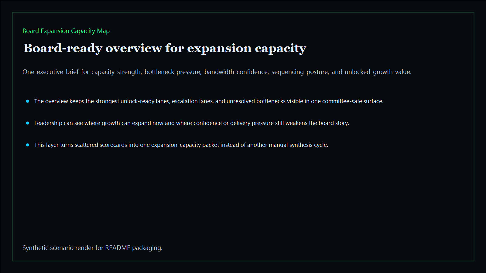
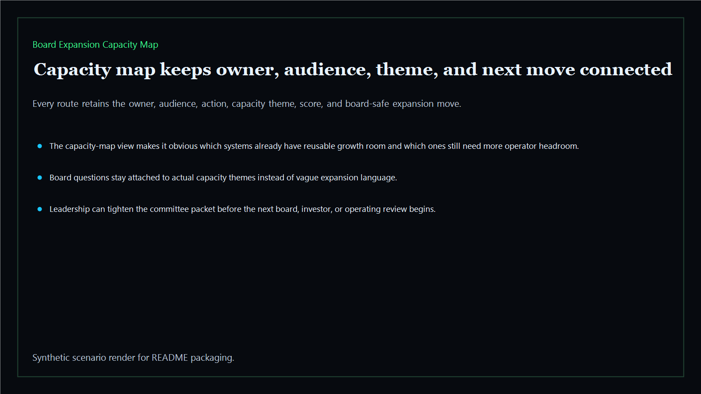
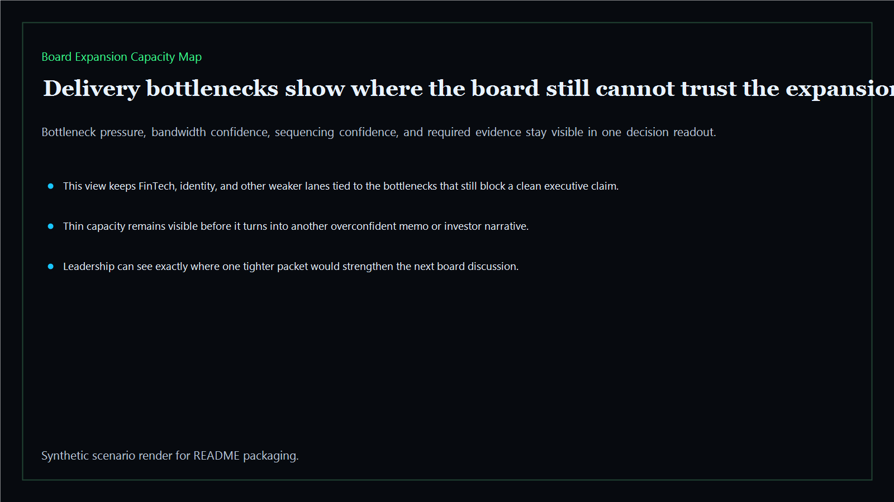
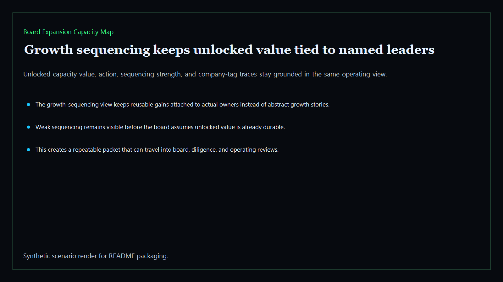

# Board Expansion Capacity Map

Board-ready expansion capacity map for throughput ceilings, operator bandwidth, delivery bottlenecks, and board-safe growth sequencing across the executive estate.

- Live: `https://capacity.kineticgain.com/`
- Repo: `mizcausevic-dev/board-expansion-capacity-map`

## Why this matters

Leaders need more than one abstract growth target. They need one capacity map that shows where bandwidth is real, where delivery ceilings still cap expansion, which teams can absorb more load, and where the board should slow growth until the operating base is stronger.

## What it includes

- TypeScript executive-intelligence surface for expansion capacity with modeled throughput signals, delivery bottlenecks, bandwidth confidence, and board-safe growth posture
- synthetic executive lanes across AI, identity, revenue, FinTech, biotech, procurement, and public-sector readiness
- reusable outputs for capacity maps, bottleneck packets, sequencing views, and board-ready operating maps
- prerendered static site, JSON payloads, screenshots, and docs

## Routes

- `/`
- `/capacity-map`
- `/delivery-bottlenecks`
- `/growth-sequencing`
- `/verification`
- `/docs`

## Local run

```bash
cd board-expansion-capacity-map
npm install
npm run verify
npm run prerender
npm run render:assets
```

## CLI

```bash
npx board-expansion-capacity-map fixtures/board-expansion-capacity-map.json --format summary
npx board-expansion-capacity-map fixtures/board-expansion-capacity-map-clean.json --format json
```

## Docs

- [Architecture](docs/architecture.md)
- [Origin](docs/ORIGIN.md)
- [Kinetic Gain Embedded](docs/KINETIC_GAIN_EMBEDDED.md)

## Screenshots






